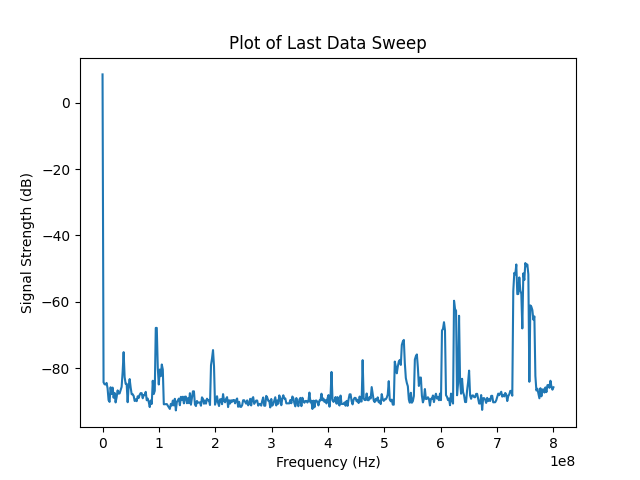

# tinySA_python
## AN UNOFFICIAL Python Library for the tinySA

# INPROGRESS. 
## From June 1 2025 - June 7 2025 there are NO promises of the stability of this project. 
## Several major feature changes + a documentation overhaul are happening.

A Non-GUI Python API class for the tinySA series of devices. This repository uses official resources and documentation but is NOT endorsed by the official tinySA product or company. See the [references](#references) section for further reading. See the [official tinySA resources](https://www.tinysa.org/wiki/) for device features.

Warning:
* This was written using the tinySA Ultra, so it is currently device specific. This will change in the near future. 
* configuration files are currently being added. until this is DONE, it's very likely there's a few bugs

Currently integrated:
* general commands and class structure
* round 1 of default device preset configs
    * tinySA Basic
    * tinySA Ultra ZS405
    * tinySA Ultra+ ZS406
    * tinySA Ultra+ ZS407

Working on it:
* filling in unfinished args
* An argparse option + some example scripts

TODO:
* error checking
* user config memory
* SD cards
* logging user input for replay
* Config files to swap between the devices

## Table of Contents
* [The tinySA Series of Devices](#the-tinysa-series-of-devices)
* [Requirements](#requirements)
* [Library Usage](#library-usage)
* [Error Handling](#error-handling)
* [Example Implementations](#example-implementations)
    * [Finding the Serial Port](#finding-the-serial-port)
    * [Serial Message Return Format](#serial-message-return-format)
    * [Connecting and Disconnecting the Device](#connecting-and-disconnecting-the-device)
    * [Toggle Error Messages](#toggle-error-messages)
    * [Device and Library Help](#device-and-library-help)
    * [Setting tinySA Parameters](#setting-tinysa-parameters)
    * [Getting Data from Active Screen](#getting-data-from-active-screen)
    * [Saving Screen Images](#saving-screen-images)
    * [Plotting Data with Matplotlib](#plotting-data-with-matplotlib)
* [List of tinySA Commands and their Library Commands](#list-of-tinysa-commands-and-their-library-commands)
* [List of Commands Removed from Library](#list-of-commands-removed-from-library)
* [Additional Library Commands](#additional-library-commands)
* [Table of Command and Device Compatibility](#table-of-command-and-device-compatibility)
* [Notes for Beginners](#notes-for-beginners)
    * [Vocab Check](#vocab-check)
    * [Calibration Setup](#calibration-setup)
* [References](#references)
* [Publications and Integration](#publications-and-integration)
* [Licensing](#licensing)  

## The tinySA Series of Devices

The [tinySA line of devices](https://tinysa.org/wiki/pmwiki.php?n=TinySA4.Comparison) are a series of portable and pretty user-friendly devices with both spectrum analyzer and signal generator capabilities. There are four main versions, all of which share the same key features. The Ultra and Ultra Plus versions build off of the original tinySA Basic. They look very similar to the [NanoVNA series](https://nanovna.com/), but are NOT the same device and have different functionalities. 

The NanoVNA series is a handheld vector network analyzer (VNA), which measures the S-parameters (loosely: a type of response of a device or antenna) over at different frequencies, while a spectrum analyzer measures the amplitude of RF signals at different frequencies. There's a lot of overlap with the use of both devices, but the measurements are very different. A signal generator is exactly what it sounds like - it generates a signal at a specific frequency or frequencies at a specified power level.

Official documentation can be found at [https://tinysa.org/](https://tinysa.org/). The official Wiki is going to be more up to date than this repo with new versions and features, and they also have links to GUI-based software (which is also under development). Several community projects also exist on GitHub.

There is also a very active tinySA community at [https://groups.io/g/tinysa](https://groups.io/g/tinysa) exploring the device capabilities and its many features. 

The end of this README will have some references and links to supporting material, but it is STRONGLY suggested to do some basic research and become familiar with your device before attempting to script or write code for it. 

## Requirements

This project requires numpy, pandas and pyserial. 

Use 'pip install -r requirements.txt' to install the following dependencies:

```python
pyserial
numpy
pandas

```

The above dependencies are only for the API interfacing of the tinySA_python library. Additional dependencies should be installed if you are following the examples in this README. These can be installed with 'pip install -r test_requirements.txt':

```python
pyserial
numpy
pandas
matplotlib
pillow

```

For anyone unfamiliar with using requirements files, or having issues with the libraries, these can also be installed manually in the terminal (we recommend a Python virtual environment) with:

```python
pip install pyserial numpy pandas matplotlib pillow

```


## Library Usage

This library is currently only available as the tinySA class in 'tinySA_python.py' in this repository. It is very much under development and missing some key error checking and handling. HOWEVER, ‘any’ error checking is currently more than the ‘no’ error checking provided by interfacing directly with the device. The code that is included in this repository has been tested on at least one tinySA device and is relatively stable. 

Several usage examples are provided in the [Example Implementations](#example-implementations) section, including working with the hardware and plotting results with matplotlib. 


## Error Handling

Some error handling has been implemented for the individual functions in this library, but not for the device configuration. Most functions have a list of acceptable formats for input, which is included in the documentation and the `library_help` function. The `tinySA_help` function will get output from the current version of firmware running on the connected tinySA device.

Detailed error messages can be returned by toggling 'verbose' on.

From the [official wiki USB Interface page](https://tinysa-org.translate.goog/wiki/pmwiki.php?n=Main.USBInterface&_x_tr_sl=auto&_x_tr_tl=en&_x_tr_hl=en-US):

    There is limited error checking against incorrect parameters or incorrect device mode. Some error checking will be integrated as the device configurations are included, but this is not intended to be exhaustive. 

Some error checking includes:
    * Frequencies can be specified using an integer optionally postfixed with a the letter 'k' for kilo 'M' for Mega or 'G' for Giga. E.g. 0.1M (100kHz), 500k (0.5MHz) or 12000000 (12MHz)
    * Levels are specified in dB(m) and can be specified using a floating point notation. E.g. 10 or 2.5
    * Time is specified in seconds optionally postfixed with the letters 'm' for mili or 'u' for micro. E.g. 1 (1 second), 2.5 (2.5 seconds), 120m (120 milliseconds)

## Example Implementations

This library has been tested on Windows, but not yet on Unix systems. The primary difference should be the format of the serial port connection, but there may be smaller bugs in format that have not been detected yet. 

### Finding the Serial Port

To start, a serial connection between the tinySA and user PC device must be created. There are several ways to list available serial ports. The library supports some rudimentary autodetection, but if that does not work instructions in this section also support manual detection. 


#### Autoconnection with the tinySA_python Library


```python


```


#### Manually Finding a Port on Windows:
1)  Open _Device Manager_, scroll down to _Ports (COM & LPT)_, and expand the menu. There should be a _COM#_ port listing "USB Serial Device(COM #)". If your tinySA Ultra is set up to work with Serial, this will be it.

2) This uses the pyserial library requirement already installed for this library. It probably also works on Linux systems, but has not been tested yet.

```python

import serial.tools.list_ports

ports = serial.tools.list_ports.comports()

for port, desc, hwid in ports:
    print(f"Port: {port}, Description: {desc}, Hardware ID: {hwid}")

```

Example output for this method (on Windows) is as follows:

```python

Port: COM4, Description: Standard Serial over Bluetooth link (COM4), Hardware ID: BTHENUM\{00001101-0000-1000-8000-00805F9B34FB}_LOCALMFG&0000\7&D0D1EE&0&000000000000_00000000
Port: COM3, Description: Standard Serial over Bluetooth link (COM3), Hardware ID: BTHENUM\{00001101-0000-1000-8000-00805F9B34FB}_LOCALMFG&0002\7&D0D1EE&0&B8B3DC31CBA8_C00000000
Port: COM10, Description: USB Serial Device (COM10), Hardware ID: USB VID:PID=0483:5740 SER=400 LOCATION=1-3

```

"COM10" is the port location of the tinySA Ultra that is used in the examples in this README.


#### Manually Finding a Port on Linux

```python
TODO
```


### Serial Message Return Format

This library returns strings as cleaned byte arrays. The command and first `\r\n` pair are removed from the front, and the `ch>` is removed from the end of the tinySA serial return.

The original message format:

```python
bytearray(b'deviceid\r\ndeviceid 0\r\nch>')
```

Cleaned version:

```python
bytearray(b'deviceid 0\r')
```

### Connecting and Disconnecting the Device
 This example shows the process for initializing, opening the serial port, getting device info, and disconnecting.

```python

# import the library class
from src.tinySA_python import tinySA

# create a new tinySA object    
tsa = tinySA()

# attempt to connect to previously discovered serial port
success = tsa.connect(port='COM10')

# if port open, then get device information and disconnect
if success == False:
    print("ERROR: could not connect to port")
else:
    msg = tsa.info()
    print(msg)
    tsa.disconnect()

```
Example output for this method is as follows:

```python

bytearray(b'tinySA ULTRA\r\n2019-2024 Copyright @Erik Kaashoek\r\n2016-2020 Copyright @edy555\r\nSW licensed under GPL. See: https://github.com/erikkaashoek/tinySA\r\nVersion: tinySA4_v1.4-143-g864bb27\r\nBuild Time: Jan 10 2024 - 11:14:08\r\nKernel: 4.0.0\r\nCompiler: GCC 7.2.1 20170904 (release) [ARM/embedded-7-branch revision 255204]\r\nArchitecture: ARMv7E-M Core Variant: Cortex-M4F\r\nPort Info: Advanced kernel mode\r\nPlatform: STM32F303xC Analog & DSP\r')

```


### Toggle Error Messages

Currently, the following can be used to turn on or off returned error messages.

1) the 'verbose' option. When enabled, detailed messages are printed out. 

```python
# detailed messages are ON
tsa.set_verbose(True) 

# detailed messages are OFF
tsa.set_verbose(False) 
```

1) the 'errorByte' option. When enabled, if there is an error with the command or configuration, `b'ERROR'` is returned instead of the default `b''`. 

```python
# when an error occurs, b'ERROR' is returned
tsa.set_error_byte_return(True) 

# when an error occurs, the default b'' might be returned
tsa. set_error_byte_return(False) 
```

### Device and Library Help

There are three options for help() with this library.

```python
# the default help function
# 1 = help for this library, other values call the tinySA device help function 
tsa.help(1)

# calling the library help function directly
tsa.library_help()

# calling the tinySA device help directly
tsa.tinySA_help()

```

All three return a bytearray in the format `bytearray(b'commands:......')`

### Setting tinySA Parameters
TODO when error checking is complete to show multiple examples

```python

```
### Getting Data from Active Screen

See other sections for the following examples:
* [Saving Screen Images](#saving-screen-images)
* [Plotting Data with Matplotlib](#plotting-data-with-matplotlib)

This example shows several types of common data requests:

```python

# import the library class for the tinySA
from src.tinySA_python import tinySA

# create a new tinySA object    
tsa = tinySA()
# attempt to connect to previously discovered serial port
success = tsa.connect(port='COM10')

# if port open, then complete task(s) and disconnect
if success == False:
    print("ERROR: could not connect to port")
else:
    #detailed messages
    tsa.setVerbose(True) #detailed messages

    # get current trace data on screen
    msg = tsa.data(val=2) 
    print(msg)

    # set current device ID
    msg = tsa.deviceid(3) 
    print(msg)

    # get current device ID
    msg = tsa.deviceid() 
    print(msg)
    
    # get device information
    msg = tsa.info() 
    print(msg)

    # pause sweeping
    msg = tsa.pause() 
    print(msg)

    # resume sweeping
    msg = tsa.resume() 
    print(msg)

    # get current battery voltage (mV)
    msg = tsa.vbat() 
    print(msg)

    tsa.disconnect()

```

### Saving Screen Images
 
 The `capture()` function can be used to capture the screen and output it to an image file. Note that the screen size varies by device. The library itself does not have a function for saving to an image (requires an additional library), but examples and the CLI wrapper have this functionality.

 This example truncates the last hex value, so a single padding `x00` value has been added. This will eventually be investigated, but it's not hurting the output right now.

```python
# import the library class for the tinySA
from src.tinySA_python import tinySA

# imports FOR THE EXAMPLE
import numpy as np
from PIL import Image
import struct

def convert_data_to_image(data_bytes, width, height):
    # this is not a particularly pretty example, and the data_bytes is sometimes a byte short (TODO:fix)

    # calculate the expected data size
    expected_size = width * height * 2  # 16 bits per pixel (RGB565), 2 bytes per pixel

    # error checking - brute force, but fine while developing
    if len(data_bytes) < expected_size:
        print(f"Data size is too small. Expected {expected_size} bytes, got {len(data_bytes)} bytes.")
        
        # if the data size is off by 1 byte, add a padding byte
        if len(data_bytes) == expected_size - 1:
            print("Data size is 1 byte smaller than expected. Adding 1 byte of padding.")
             # add a padding byte (0x00) to make the size match
            data_bytes.append(0) 
        else:
            return

    elif len(data_bytes) > expected_size:
        # truncate the data to the expected size (in case it's larger than needed)
        data_bytes = data_bytes[:expected_size]
        print("Data is larger than the expected size. trunacting. check data.")

    # unpack the byte array to get pixel values (RGB565 format)
    num_pixels = width * height
    # unpacking as unsigned shorts (2 bytes each)
    x = struct.unpack(f">{num_pixels}H", data_bytes)  

    # convert the RGB565 to RGBA
    arr = np.array(x, dtype=np.uint32)
    arr = 0xFF000000 + ((arr & 0xF800) >> 8) + ((arr & 0x07E0) << 5) + ((arr & 0x001F) << 19)

    # reshape array to match the image dimensions. (height, width) format
    arr = arr.reshape((height, width)) 

    # create the image
    img = Image.frombuffer('RGBA', (width, height), arr.tobytes(), 'raw', 'RGBA', 0, 1)

    # save the image
    img.save("capture_example.png")

    # show the image
    img.show()

# create a new tinySA object    
tsa = tinySA()
# attempt to connect to previously discovered serial port
success = tsa.connect(port='COM10')

# if port closed, then return error message
if success == False:
    print("ERROR: could not connect to port")
else: # port open, complete task(s) and disconnect
    # detailed messages turned on
    tsa.setVerbose(True) 
    # get the trace data
    data_bytes = tsa.capture() 
    print(data_bytes)
    tsa.disconnect()

    # processing after disconnect (just for this example)
    # test with 480x320 resolution for tinySA Ultra
    convert_data_to_image(data_bytes, 480, 320)

```

<p align="center">
        
</p>
   <p align="center">Capture On-Screen Trace Data of a Frequency Sweep from 100 kHz to 800 kHz</p>

### Plotting Data with Matplotlib

This example plots the last/current sweep of data from the tinySA device. 
`data()` gets the trace data. `frequencies()` gets the frequency values used. 
`byteArrayToNumArray(byteArr)` takes in the returned trace data and frequency 
bytearrays and converts them to arrays that are then plotted using `matplotlib`

```python
# import the library class for the tinySA
from src.tinySA_python import tinySA

# import matplotlib FOR THE EXAMPLE
import matplotlib.pyplot as plt

# functions used in this example
def byteArrayToNumArray(byteArr, enc="utf-8"):
    # decode the bytearray to a string
    decodedStr = byteArr.decode(enc)
    # split the string by newline characters
    stringVals = decodedStr.splitlines()
    # convert each value to a float
    floatVals = [float(val) for val in stringVals]
    return floatVals

# create a new tinySA object    
tsa = tinySA()
# attempt to connect to previously discovered serial port
success = tsa.connect(port='COM10')

# if port closed, then return error message
if success == False:
    print("ERROR: could not connect to port")
else: # port open, complete task(s) and disconnect
    # detailed messages turned on
    tsa.setVerbose(True) 
    # get the trace data
    data_bytes = tsa.data() 
    print(data_bytes)
    # get the frequencies used by the last sweep
    freq_bytes = tsa.frequencies() 
    tsa.disconnect()

    # processing after disconnect (just for this example)
    dataVals = byteArrayToNumArray(data_bytes)
    print(len(dataVals))  # length of 450 data points

    freqVals = byteArrayToNumArray(freq_bytes)
    print(len(freqVals))  # length of 450 data points

    # create the plot
    plt.plot(freqVals, dataVals)

    # add labels and title
    plt.xlabel('Frequency (Hz)')
    plt.ylabel('Signal Strength (dB)')
    plt.title('Plot of Last Data Sweep')

    # show the plot
    plt.show()

```

<p align="center">
        
</p>
   <p align="center">Plotted On-Screen Trace Data of a Frequency Sweep from 100 kHz to 800 kHz</p>

## List of tinySA Commands and their Library Commands

Library functions are organized based on the command passed to the device. For example, any functions with shortcuts for using the `sweep` command will be grouped under `sweep`. This list and the following list in the [Additional Library Commands](#additional-library-commands) section describe the functions in this library. 

This section is sorted by the tinySA (Ultra) commands, and includes:
* A brief description of what the command does
* What the original usage looked like
* The tinySA_python function call, or calls if multiple options exist 
* Example return, or example format of return
* Any additional notes about the usage

All of the listed commands are included in this API to some degree, but error checking may be incomplete.

Quick Link Table:
|  |   |     |   |       |      |      |
|-------|-------|-------|-------|-------|-------|-------|
| [abort](#abort)   | [actual_freq](#actual_freq)  | [agc](#agc)      | [attenuate](#attenuate)  | [bulk](#bulk)       | [calc](#calc)        | [caloutput](#caloutput) |
| [capture](#capture) | [clearconfig](#clearconfig) | [color](#color)   | [correction](#correction) | [dac](#dac)        | [data](#data)        | [deviceid](#deviceid)  |
| [direct](#direct) | [ext_gain](#ext_gain)    | [fill](#fill)       | [freq](#freq)        | [freq_corr](#freq_corr) | [frequencies](#frequencies) | [help](#help)  |
| [hop](#hop)            | [if](#if)           | [if1](#if1)          | [info](#info)     | [level](#level)             | [levelchange](#levelchange) | [leveloffset](#leveloffset) |
| [line](#line) | [load](#load)   | [lna](#lna)          | [lna2](#lna2)     | [marker](#marker)           | [menu](#menu)     | [mode](#mode)           |
| [modulation](#modulation) | [output](#output)  | [pause](#pause)   | [rbw](#rbw)                 | [recall](#recall) | [refresh](#refresh)     | [release](#release) |
| [remark](#remark)    | [repeat](#repeat) | [reset](#reset)             | [restart](#restart) | [resume](#resume)      | [save](#save)       | [saveconfig](#saveconfig) |
| [scan](#scan)     | [scanraw](#scanraw)         | [sd_delete](#sd_delete) | [sd_list](#sd_list)   | [sd_read](#sd_read) | [selftest](#selftest) | [spur](#spur)     |
| [status](#status)           | [sweep](#sweep)   | [sweeptime](#sweeptime) | [sweep_voltage](#sweep_voltage) | [text](#text)   | [threads](#threads) | [touch](#touch)             |
| [touchcal](#touchcal) | [touchtest](#touchtest) | [trace](#trace)     | [trigger](#trigger)  | [ultra](#ultra)   | [usart_cfg](#usart_cfg)     | [vbat](#vbat)     |
| [vbat_offset](#vbat_offset) | [version](#version) | [wait](#wait)        | [zero](#zero)     |                         |                     |                      |

### **actual_freq**
* **Status:** Getting works, setting does not.
* **Description:**  Gets the frequency correction set by CORRECT FREQUENCY menu in the expert menu settings
* **Original Usage:** `actual_freq [{frequency in Hz}]`
* **Library Function Call:** `actual_freq(val=None|Int)`
* **Example Return:** 3000000000
* **Notes:**  freq in Hz going by the returns. Should be able to set the value with this, according to documentation, but its probably a format issue in the library.

### **agc**
* **Status:** Done
* **Description:**  Enables/disables the build in Automatic Gain Control
* **Original Usage:** `agc 0..7|auto`
* **Library Function Call:** `agc(val="auto"|0..7)`
* **Example Return:** empty bytearray
* **Notes:**

### **attenuate**
* **Status:** Done
* **Description:** Sets the internal attenuation
* **Original Usage:** `attenuate [auto|0-31]`
* **Library Function Call:** `attenuate(val="auto"|0..31)`
* **Example Return:** empty bytearray
* **Notes:** 

### **bulk**
* **Status:** TODO
* **Description:** Sent by tinySA when in auto refresh mode
* **Original Usage:** `????`
* **Library Function Call:** `bulk()`
* **Example Return:** `format: "bulk\r\n{X}{Y}{Width}{Height} {Pixeldata}\r\n"`
* **Notes:** All numbers are binary coded 2 bytes little endian. The pixel data is encoded as 2 bytes per pixel           
            

### **calc**
* **Status:** Done
* **Description:** Sets or cancels one of the measurement modes
* **Original Usage:** `calc off|minh|maxh|maxd|aver4|aver16|quasip`
* **Library Function Call:** `calc(val="off"|"minh"|"maxh"|"maxd"|"aver4"|"aver16"|"quasip")`
* **Example Return:** empty bytearray
* **Notes:** 
  * the commands are the same as those listed in the MEASURE menu
  * [tinySA Calc Menu](#https://tinysa.org/wiki/pmwiki.php?n=Main.CALC):
    * OFF disables any calculation 
    * MIN HOLD sets the display to hold the minimum value measured. Reset the hold by selecting again. This setting is used to see stable signals that are within the noise 
    * MAX HOLD sets the display to hold the maximum value measured. Reset the hold by selecting again. This setting can be used for many measurements such as showing the power envelope of a modulated signal. 
    * MAX DECAY sets the display to hold the maximum value measured for a certain number of scans after which the maximum will start to decay. The default number of scans to hold is 20. This default can be changed in the SETTINGS menu. This setting is used instead of MAX HOLD to reduce the impact of spurious signals 
    * AVER 4 sets the averaging to new_measurement = old_measurement*3/4+measured_value/4. By default the averaging is linear power averaging 
    * AVER 16 sets the averaging to new_measurement = old_measurement*15/16+measured_value/16. By default the averaging is linear power averaging 

### **caloutput**
* **Status:** Done
* **Description:** Disables or sets the caloutput to a specified frequency in MHz
* **Original Usage:** `caloutput off|30|15|10|4|3|2|1`
* **Library Function :**  `caloutput(val="off"|30|15|10|4|3|2|1)`
* **Example Return:** empty bytearray
* **Notes:**

### **capture**
* **Status:** Done
* **Description:** Requests a screen dump to be sent in binary format of HEIGHTxWIDTH pixels of each 2 bytes
* **Original Usage:** `capture`
* **Library Function Call:** `capture()`
* **Example Return:** `format:'\x00\x00\x00\x00\x00\x00\x00\...x00\x00\x00'`
* **Notes:** tinySA original: 320x240, tinySA Ultra: 480x320 

### **clearconfig**
* **Status:** Done
* **Description:** Resets the configuration data to factory defaults
* **Original Usage:** `clearconfig`
* **Library Function Call:** `clearconfig()`
* **Example Return:** `b'Config and all calibration data cleared. \r\n Do reset manually to take effect. Then do touch calibration and save.\r'`
* **Notes:** Requires password '1234'. Hardcoded. Other functions need to be used with this to complete the process.

### **color**
* **Status:** Done
* **Description:** Sets or gets the colors used
* **Original Usage:** `color [{id} {rgb24}]`
* **Library Function Call:** `color(ID=None|0..31, RGB=None(default:'0xF8FCF8')|'0x000000'..'0xFFFFFF')`
* **Example Return:** If ID='None' used:  
`0: 0x000000\r\n  1: 0xF8FCF8\r\n  2: 0x808080\r\n  3: 0xE0E4E0\r\n  4: 0x000000\r\n  5: 0xD0D0D0\r\n  6: 0xF8FC00\r\n  7: 0x40FC40\r\n  8: 0xF800F8\r\n  9: 0xF84040\r\n 10: 0x18E000\r\n 11: 0xF80000\r\n 12: 0x0000F8\r\n 13: 0xF8FCF8\r\n 14: 0x808080\r\n 15: 0x00FC00\r\n 16: 0x808080\r\n 17: 0x000000\r\n 18: 0xF8FCF8\r\n 19: 0x0000F8\r\n 20: 0xF88080\r\n 21: 0x00FC00\r\n 22: 0x888C88\r\n 23: 0xD8DCD8\r\n 24: 0x282828\r\n 25: 0xC0C4C0\r\n 26: 0xF8FCF8\r\n 27: 0x00FC00\r\n 28: 0x00FCF8\r\n 29: 0xF8FC00\r\n 30: 0x000000\r\n 31: 0x000000\r'`
* **Notes:** the hex value currently must be passed in as a string

### **correction**
* **Status:** Done
* **Description:** Sets or gets the frequency level correction table
* **Original Usage:** `correction {low|lna|ultra|ultra_lna|direct|direct_lna|harm|harm_lna|out|out_direct|out_adf|out_ultra|off|on} [{0-19} {frequency(Hz)} {value(dB)}]`
* **Library Function Call:** `correct(tableName, slot, freq, val)`
* **Example Return:** empty bytearray
* **Notes:** See [Correction Wiki](https://tinysa.org/wiki/pmwiki.php?n=Main.Correction). The current content of the table is shown by entering `correction low` without any arguments. The data in the table can be modified by specifying the slot number and the new values. There **MUST** be one entry in the low table for 30MHz and the correction for that frequency **MUST** be zero. 
* **Future Work:** **Confirm table format across devices**. Value currently limited between -10 and 35, but this needs to be more specific.

### **dac**
* **Status:** Done
* **Description:** Sets or gets the dac value
* **Original Usage:** `dac [0..4095]`
* **Library Function Call(s):** `dac(val=None|0..4095)`
* **Example Return:** `b'usage: dac {value(0-4095)}\r\ncurrent value: 1922\r'`
* **Notes:**

### **data**
* **Status:** Done
* **Description:** Gets the trace data
* **Original Usage:** `data 0..2`
* **Library Function Call:** `data(val=0|1|2)`
* **Example Return:** `format bytearray(b'7.593750e+00\r\n-8.437500e+01\r\n-8.693750e+01\r\n...\r')`
* **Notes:**  0 = temp value, 1 = stored trace, 2 = measurement. strength in decibels (dB) 
       
          
### **deviceid**
* **Status:** Done
* **Description:** Sets or gets a user settable integer number ID that can be use to identify a specific tinySA connected to the PC
* **Original Usage:** `deviceid [{number}]`
* **Library Function Call:** `deviceid(id=None|{int number})`
* **Example Return:** `'deviceid 0\r'`
* **Notes:**

### **direct**
* **Status:** TODO
* **Description:** ??
* **Original Usage:** `direct {start|stop|on|off} {freq(Hz)}`
* **Library Function Call:** `direct()`
* **Example Return:** empty bytearray
* **Notes:**

### **ext_gain**
* **Status:** Done
* **Description:** Sets the external attenuation/amplification
* **Original Usage:** `ext_gain -100..100`
* **Library Function Call:** `ext_gain(val=-100...100)`
* **Example Return:** empty bytearray
* **Notes:** Works in both input and output mode

### **fill**
* **Status:** TODO
* **Description:** Sent by tinySA when in auto refresh mode
* **Original Usage:**
* **Library Function Call:**
* **Example Return:** `format: "fill\r\n{X}{Y}{Width}{Height} {Color}\r\n"`
* **Notes:** All numbers returned are binary coded 2 bytes little endian. Similar to 'bulk'???

### **freq**
* **Status:** Done
* **Description:** Pauses the sweep and sets the measurement frequency in Hz.
* **Original Usage:** `freq {frequency}`
* **Library Function Call:** `freq()`
* **Example Return:** empty bytearray
* **Notes:**  

### **freq_corr**
* **Status:** Done
* **Description:** Gets the frequency correction.
* **Original Usage:** `freq_corr`
* **Library Function Call:**  `freq_corr()`
* **Example Return:** `b'0 ppb\r'`
* **Notes:** This command returns the frequency correction, in parts per billion (ppb).

### **frequencies**
* **Status:** Done
* **Description:** Gets the frequencies used by the last sweep
* **Original Usage:** `frequencies`
* **Library Function Call:**  `frequencies()`
* **Example Return:**  `b'1500000000\r\n... \r\n3000000000\r'`
* **Notes:**  

### **help**
* **Status:** TODO libraryHelp() 
* **Description:** Gets a list of the available commands
* **Original Usage:** `help`
* **Library Function Calls:**
    * `help(val=0|1)` 
    * `tinySAHelp()`
    * `libraryHelp()` 
* **Example Return:**   
* **Notes:** 0 = tinySAHelp(), 1=libraryHelp(). Both functions can also be called directly. libraryHelp() has more information about this library and the inputs. 

### **hop**
* **Status:** TODO. needs error checking added
* **Description:** Measures the input level at each of the indicated frequencies.
* **Original Usage:** `hop {start(Hz)} {stop(Hz)} {step(Hz) | points}  [outmask]`
* **Library Function Call:**
* **Example Return:** empty bytearray
* **Notes:** Ultra only. From [tinysa-org](https://tinysa-org.translate.goog/wiki/pmwiki.php?n=Main.USBInterface&_x_tr_sl=auto&_x_tr_tl=en&_x_tr_hl=en-US): if the 3rd parameter is below 450 it is assumed to be points, otherwise as step frequency Outmask selects if the frequency (1) or level (2) is output. 

### **if**
* **Status:** Done
* **Description:** Sets the intermediate frequency (IF) to automatic or a specific value
* **Original Usage:** `if (0|433M..435M )`
* **Library Function Call:** `setIF(val=0|433M..435M|'auto')`
* **Example Return:** empty bytearray
* **Notes:** Val input of 0 is 'auto'. Added explicit 'auto' to match other library funcs.

### **if1**
* **Status:** Done
* **Description:** Sets intermediate frequency (IF) to a specific value
* **Original Usage:** `if1 (975M..979M )`
* **Library Function Call:** `setIF1(val=0|975M..979M|'auto')`
* **Example Return:** empty bytearray
* **Notes:** Val input of 0 is 'auto'. Added explicit 'auto' to match other library funcs.

### **info**
* **Status:** Done
* **Description:** Displays various software/firmware and hardware information
* **Original Usage:** `info`
* **Library Function Call:** `info()`
* **Example Return:** `b'tinySA ULTRA\r\n2019-2024 Copyright @Erik Kaashoek\r\n2016-2020 Copyright edy555\r\nSW licensed under GPL. See: https://github.com/erikkaashoek/tinySA\r\nVersion: tinySA4_v1.-143-g864bb27\r\nBuild Time: Jan 10 2024 - 11:14:08\r\nKernel: 4.0.0\r\nCompiler: GCC 7.2.1 20170904 (release) [ARM/embedded-7-branch revision 255204]\r\nArchitecture: ARMv7E-M Core Variant: Cortex-M4F\r\nPort Info: Advanced kernel mode\r\nPlatform:STM32F303xC Analog & DSP\r'`
* **Notes:**

### **level**
* **Status:** Done
* **Description:** Sets the output level
* **Original Usage:** `level -76..13`
* **Library Function Call:** `level(val=-76...13)`
* **Example Return:** empty bytearray
* **Notes:** Not all values in the range are available.  

### **levelchange**
* **Status:** Done
* **Description:** Sets the output level delta for low output mode level sweep
* **Original Usage:** `levelchange -70..+70`
* **Library Function Call:** `levelchange(val=-70...70)`
* **Example Return:** empty bytearray
* **Notes:** 

### **leveloffset**
* **Status:** TODO
* **Description:** Sets or gets the level calibration data
* **Original Usage:** `leveloffset low|high|switch [output] {error}`
* **Library Function Call:**
* **Example Return:** empty bytearray
* **Notes:** For the output corrections first ensure correct output levels at maximum output level. For the low output set the output to -50dBm and measure and correct the level with "leveloffset switch error" where For all output leveloffset commands measure the level with the leveloffset to zero and calculate error = measured level - specified level

### **line**
* **Status:** TODO
* **Description:** 
* **Original Usage:**  `line off|{level}` 
* **Library Function Call:**
* **Example Return:** empty bytearray
* **Notes:**  

### **load**
* **Status:** Done
* **Description:** Loads a previously stored preset to the connected device
* **Original Usage:** `load 0..4`
* **Library Function Call:** `load(val=0|1|2|3|4)`
* **Example Return:** empty bytearray
* **Notes:** 0 is the startup preset

### **lna**
* **Status:** Done
* **Description:** Set lna usage off/on
* **Original Usage:** `lna off|on` 
* **Library Function Call:** `lna(val="off"|"on")`
* **Example Return:** empty bytearray
* **Notes:** Should not be enabled when AGC is enabled - [tinySA wiki SETTINGS2](https://tinysa.org/wiki/pmwiki.php?n=Main.SETTINGS2)

### **marker**
* **Status:** TODO
* **Description:** sets or dumps marker info
* **Original Usage:**  `marker {id} on|off|peak|{freq}| {index}`
* **Library Function Call:** `marker()`
* **Example Return:** empty bytearray
* **Notes:**  where id=1..4 index=0..num_points-1
Marker levels will use the selected unit Marker peak will activate the marker (if not done already), position the marker on the strongest signal and display the marker info The frequency must be within the selected sweep range mode 

### **menu**
* **Status:** TODO
* **Description:** The menu command can be used to activate any menu item based on the index of the menu item
* **Original Usage:** `menu {#} [{#} [{#} [{#}]]]`
* **Library Function Call:** `menu([])`
* **Example Return:** empty bytearray
* **Notes:** where # is the menu entry number starting with 1 at the top.
Example: menu 6 2 will toggle the waterfall option 
[tinySA Menu Tree](https://tinysa.org/wiki/pmwiki.php?n=TinySA4.MenuTree)

### **mode**
* **Status:** TODO
* **Description:** Sets the mode of the tinySA
* **Original Usage:** `mode low|high input|output`
* **Library Function Call:** `mode(freq)`
* **Example Return:** empty bytearray
* **Notes:** [tinySA Wiki MODE](https://tinysa.org/wiki/pmwiki.php?n=Main.MODE)
* LOW INPUT activates the 0.1-350MHz input mode
* HIGH INPUT activates the 240MHz-960MHz input mode
* LOW OUTPUT activates the 0.1-350MHz output mode
* HIGH OUTPUT activates the 240MHz-960MHz output mode 

### **modulation**
* **Status:** TODO
* **Description:** Set the modulation in output mode
* **Original Usage:** `modulation off|AM_1kHz|AM_10Hz|NFM|WFM|extern`
* **Library Function Call:** `modulation()`
* **Example Return:** empty bytearray
* **Notes:**

### **nf**
* **Status:** TODO
* **Description:** ??
* **Original Usage:** ` `
* **Library Function Call:** ` `
* **Example Return:** empty bytearray
* **Notes:** Check documentation on this to see if more options

### **output**
* **Status:** Done
* **Description:** Sets the output on or off
* **Original Usage:** `output on|off`
* **Library Function Call:** `output(val="off"|"on")`
* **Example Return:** empty bytearray
* **Notes:**

### **pause**
* **Status:** Done
* **Description:** Pauses the sweeping in either input or output mode
* **Original Usage:** `pause`
* **Library Function Call:** `pause()`
* **Example Return:** empty bytearray
* **Notes:**

### **rbw**
* **Status:** Done
* **Description:** sets the rbw to either automatic or a specific value
* **Original Usage:** `rbw auto|3..600`
* **Library Function Call:** `rbw(val="auto"|3..600)`
* **Example Return:**  empty bytearray
* **Notes:** the number specifies the target rbw in kHz. Frequencies listed in official documentation: 3 kHz, 10 kHz, 30 kHz, 100 kHz, 300 kHz, 600 kHz     

### **recall**
* **Status:** Done
* **Description:** Loads a previously stored preset from the device
* **Original Usage:** ` recall 0..4`
* **Library Function Call:** `recal(val=0|1|2|3|4)`
* **Example Return:** empty bytearray
* **Notes:** Same functionality as `load()`. 0 is the startup preset.

### **refresh**
* **Status:** Done
* **Description:** Enables or disables the auto refresh mode
* **Original Usage:** `refresh on|off`
* **Library Function Call:** `refresh(val="off"|"on")`
* **Example Return:** empty bytearray
* **Notes:**

### **release**
* **Status:** Done
* **Description:** Triggers a signal for the removal/release of the touch screen
* **Original Usage:** `release`
* **Library Function Call:** `release()`
* **Example Return:** empty bytearray
* **Notes:**

### **remark**
* **Status:** TODO
* **Description:** does nothing
* **Original Usage:** `remark [use any text]`
* **Library Function Call:**
* **Example Return:** empty bytearray
* **Notes:** ?? included due to documentation 

### **repeat**
* **Status:** Done
* **Description:** Sets the number of (re)measurements that should be taken at every frequency
* **Original Usage:** ` repeat 1..1000`
* **Library Function Call:** `repeat(val=1.1000)`
* **Example Return:** empty bytearray
* **Notes:** increasing the repeat reduces the noise per frequency, repeat 1 is the normal scanning mode. Has int(val) conversion.

### **reset**
* **Status:** Done
* **Description:** Resets the tinySA
* **Original Usage:** `reset`
* **Library Function Call:** `reset()`
* **Example Return:** empty bytearray, serial error message. depends on the system.
* **Notes:** Disconnects the serial.

### **resume**
* **Status:** Done
* **Description:** Resumes the sweeping in either input or output mode
* **Original Usage:** `resume`
* **Library Function Call:** `resume()`
* **Example Return:** empty bytearray
* **Notes:**

### **save**
* **Status:** Done
* **Description:** Saves the current setting to a preset
* **Original Usage:** `save 0..4`
* **Library Function Call:** `save(val=0..4)`
* **Example Return:** empty bytearray
* **Notes:** where 0 is the startup preset

### **saveconfig**
* **Status:** Done
* **Description:** Saves the device configuration data
* **Original Usage:** `saveconfig`
* **Library Function Call:** `saveconfig()`
* **Example Return:** empty bytearray
* **Notes:**
 
### **scan**
* **Status:** TODO
* **Description:** Performs a scan and optionally outputs the measured data
* **Original Usage:** `scan {start(Hz)} {stop(Hz)} [points] [outmask]`
* **Library Function Call:**
* **Example Return:** empty bytearray
* **Notes:** where the outmask is a binary OR of 1=frequencies, 2=measured data, 4=stored data and points is maximum 290

### **scanraw**
* **Status:** TODO
* **Description:** Performs a scan of unlimited amount of points and send the data in binary form
* **Original Usage:** `scanraw {start(Hz)} {stop(Hz)} [points][option]`
* **Library Function Call:**
* **Example Return:** empty bytearray
* **Notes:** From Documentation 1: The measured data is send as '{' ('x' MSB LSB)*points '}' where the 16 bit data is scaled by 32.

From Documentation 2: The measured data is the level in dBm and is send as '{' ('x' MSB LSB)*points '}'. To get the dBm level from the 16 bit data, divide by 32 and subtract 128 for the tinySA and 174 for the tinySA Ultra. The option, when present, can be either 0,1,2 or 3 being the sum of 1=unbuffered and 2=continuous 

UNDERGROING TESTING
   
### **sd_delete**
* **Status:** TODO
* **Description:** Deletes a specific file on the sd card
* **Original Usage:** `sd_delete {filename}`
* **Library Function Call:**
* **Example Return:** empty bytearray
* **Notes:**

### **sd_list**
* **Status:** Done
* **Description:** Displays list of filenames with extension and sizes
* **Original Usage:** `sd_list`
* **Library Function Call:** `sd_list()`
* **Example Return:** format example: `-0.bmp 307322`
* **Notes:**
  
### **sd_read**
* **Status:**  TODO
* **Description:** Reads a specific file on the sd card
* **Original Usage:** `sd_read {filename}`
* **Library Function Call:** `sd_read(filename)`
* **Example Return:** empty bytearray
* **Notes:**

### **selftest**
* **Status:** Done
* **Description:** performs one or all selftests
* **Original Usage:** `selftest 0 0..9`, `selftest (1-3) [arg]`
* **Library Function Call:** `selftest(val=0..9)`
* **Example Return:** empty bytearray
* **Notes:** MUST have cable connected to RF and CAL
  
    
### **spur**
* **Status:** Done
* **Description:** Enables or disables spur reduction
* **Original Usage:** `spur on|off`
* **Library Function Call:** `spur(val="off"|"on")`
* **Example Return:** empty bytearray
* **Notes:**
 

### **status**
* **Status:** Done
* **Description:** Displays the current device status (paused/resumed)
* **Original Usage:** `status`
* **Library Function Call:** `status()`
* **Example Return:** `b'Resumed'`
* **Notes:**

### **sweep**
* **Status:** TODO
* **Description:** Set sweep boundaries or execute a sweep
* **Original Usage:** `sweep [(start|stop|center|span|cw {frequency}) | ({start(Hz)} {stop(Hz)} [0..290] ) ]`
* **Library Function Call:**
* **Example Return:** empty bytearray
* **Notes:** sweep without arguments lists the current sweep settings, the frequencies specified should be within the permissible range. The sweep commands apply both to input and output modes

### **sweeptime**
* **Status:** TODO
* **Description:** Sets the sweeptime
* **Original Usage:** `sweep {time(Seconds)}`
* **Library Function Call:**
* **Example Return:** empty bytearray
* **Notes:** the time specified may end in a letter where  m=mili and u=micro

### **text**
* **Status:**  Done
* **Description:** specifies the text entry for the active keypad 
* **Original Usage:** `text keypadtext `
* **Library Function Call:** `text(val="")`
* **Example Return:** empty bytearray
* **Notes:** where keypadtext is the text used. Example: text 12M. Currently does not work for entering file names. 

### **threads**
* **Status:** Done
* **Description:** lists information of the threads in the tinySA
* **Original Usage:** `threads`
* **Library Function Call:** `threads()`
* **Example Return:** `b'stklimit|        |stk free|    addr|refs|prio|    state|        name\r\n20000200|2000054C|00000248|200016A8|   0| 128|  CURRENT|        main\r\n20001530|2000157C|0000008C|20001650|   0|   1|    READY|        idle\r\n200053D8|200056C4|00000250|200059B0|   0| 127|    READY|       sweep\r'`
* **Notes:**

### **touch**
* **Status:** Done
* **Description:** sends the coordinates of a touch
* **Original Usage:** `touch {X coordinate} {Y coordinate}`
* **Library Function Call:** `touch(x=0,y=0)`
* **Example Return:** empty bytearray
* **Notes:** The upper left corner of the screen is "0 0"

### **touchcal**
* **Status:** Done
* **Description:** starts the touch calibration
* **Original Usage:** `touchcal`
* **Library Function Call:** `touchcal()`
* **Example Return:** empty bytearray
* **Notes:** is there a way to cancel this?

### **touchtest**
* **Status:** Done
* **Description:** starts the touch test
* **Original Usage:** `touchtest`
* **Library Function Call:** `touchtest()`
* **Example Return:** empty bytearray
* **Notes:** instructions on screen "touch panel, draw lines, press button to complete"

### **trace**
* **Status:** TODO
* **Description:** displays all or one trace information or sets trace related information
* **Original Usage:** `trace [{0..2} | dBm|dBmV|dBuV| V|W |store|clear|subtract | (scale|reflevel) auto|{level}]`
* **Library Function Call:**
* **Example Return:** empty bytearray
* **Notes:**

### **trigger**
* **Status:** TODO
* **Description:** sets the trigger type or level
* **Original Usage:** `trigger auto|normal|single|{level(dBm)}`
* **Library Function Call:**
* **Example Return:** empty bytearray
* **Notes:** the trigger level is always set in dBm

### **ultra**
* **Status:** Done
* **Description:** turn on/config tiny SA ultra mode
* **Original Usage:** `ultra off|on|auto|start|harm {freq}`
* **Library Function Call:** `ultra(val="on"|"off")`
* **Example Return:** empty bytearray
* **Notes:** limited input until more documentation found

### **usart_cfg**
* **Status:** Done
* **Description:** Get port current baud rate/ gets the current serial config
* **Original Usage:** `usart_cfg`
* **Library Function Call:** `usart_cfg()`
* **Example Return:** `b'Serial: 115200 baud\r'`
* **Notes:**  default is 115,200

### **vbat**
* **Status:** Done
* **Description:** Get the current battery voltage
* **Original Usage:** `vbat`
* **Library Function Call:**
* **Example Return:** empty bytearray
* **Notes:**

### **vbat_offset**
* **Status:** Done
* **Description:** Sets or gets the battery offset value
* **Original Usage:** `vbat_offset [{0..4095}]`
* **Library Function Call:** `vbat_offset(val=None|0..4095)`
* **Example Return:** `b'300\r'`
* **Notes:**

### **version**
* **Status:** Done
* **Description:** returns the version text
* **Original Usage:** `version`
* **Library Function Call:** `version()` 
* **Example Return:** empty bytearray
* **Notes:**

### **wait**
* **Status:** Done
* **Description:** wait for a single sweep to finish and pauses sweep or waits for specified number of seconds
* **Original Usage:** `wait [{seconds}]`
* **Library Function Call:**
* **Example Return:** empty bytearray
* **Notes:**

### **zero**
* **Status:** TODO: documentation
* **Description:**
* **Original Usage:** `zero {level}\r\n174dBm`
* **Library Function Call:**
* **Example Return:** empty bytearray
* **Notes:**


''' Full list of help commands
commands: freq time dac nf saveconfig clearconfig zero sweep pause resume wait repeat status caloutput save recall trace trigger marker line usart_cfg vbat_offset color if if1 lna2 agc actual_freq freq_corr attenuate level sweeptime leveloffset levelchange modulation rbw mode spur lna direct ultra load ext_gain output deviceid correction calc menu text remark

Other commands: version reset data frequencies scan hop scanraw test touchcal touchtest usart capture refresh touch release vbat help info selftest sd_list sd_read sd_delete threads
'''

The list of commands from 'help' that are still 'unknown' or don’t appear to have an impact on the tinySA via this Python API:

'''
usart

'''

## List of Commands Removed from Library

### **abort**
* **Status:** REMOVED. NOT ON DEVELOPER'S DUT
* **Description:**  Sets the abortion enabled status (on/off) or aborts the previous command.
* **Original Usage:** `abort [off|on]`
* **Library Function Call:** `abort(val=None|"off"|"on")` 
* **Example Return:** ????
* **Notes:** When used without parameters the previous command still running will be aborted. Abort must be enabled before using the "abort on" command. Additional error checking has been added with the 'verbose' option. 

### **lna2**
* **Status:** REMOVED until more documentation is confirmed
* **Description:** ??
* **Original Usage:** `lna2 0..7|auto`
* **Library Function Call:** `lna2(val="auto"|0..7)`
* **Example Return:** empty bytearray
* **Notes:**

### **restart**
* **Status:** REMOVED. Not recognized by DUT.
* **Description:** Restarts the  tinySA after the specified number of seconds
* **Original Usage:** `restart {seconds}`
* **Library Function Call:** `restart(val=0...)`
* **Example Return:** empty bytearray
* **Notes:** where 0 seconds stops the restarting process. has int(val) conversion until it's clear if float() causes issues.

### **sweep_voltage**
* **Status:** REMOVED
* **Description:** Sets the sweep voltage 
* **Original Usage:** `sweep_voltage {0-3.3}`
* **Library Function Call:** `sweep_voltage()`
* **Example Return:** empty bytearray
* **Notes:** device does not recognize this


## Additional Library Commands

## Table of Command and Device Compatibility

This library was developed with the tinySA Ultra, and there's some commands that might have been added/dropped between devices. This table is a record of CURRENT known compatibility with THIS library, and to what level the PC can interact with the device. It is HIGHLY likely to NOT be complete. 

If a last checked firmware version is known, that is included in the header in the parenthesis. 

?? is for an unfinished TODO list item, not an unknown. When a function is complete its compatibility is added.

|  Device Command  | tinySA Basic  | tinySA Ultra (ZS405)| tinySA Ultra + (ZS406)| | tinySA Ultra + (ZS407)|
|------------------|-------------|----------------|------------------|------------------|
| abort | |??| | |
| actual_freq| | Get Only | | |
| agc| | Set | | |
| attenuate| | Set | | |
| bulk| | ??| | |
| calc| | Set | | |
| caloutput| | Set | | |
| capture| | Get| | |
| clearconfig| | Reset | | |
| color| | Set and Get | | |
| correction| |Set and Get| | |
| dac| |Set and Get | | |
| data| | Get | | |
| deviceid|| Set and Get | | |
| direct| |??| | |
| ext_gain| | Set | | |
| fill| |??| | |
| freq| |Set| | |
| freq_corr| |Get | | |
| frequencies| |Get | | |
| help| |Get | | |
| hop| No | ?? | | |
| if| | Set | | |
| if1| | Set | | |
| info| | Get| | |
| level| | Set | | |
| levelchange| | Set| | |
| leveloffset| | ??| | |
| line| | ??| | |
| load| |Load to Device| | |
| lna| | Set | | |
| marker| | ??| | |
| menu| |?? | | |
| mode| |??| | |
| modulation| | ??| | |
| nf| | ??| | |
| output| |?? | | |
| pause| | Set| | |
| rbw| | ??| | |
| recall| |Load to Device| | |
| refresh| | | | |
| release| | | | |
| remark| | | | |
| repeat| | | | |
| reset| | | | |
| resume| | | | |
| save| | | | |
| saveconfig| | | | |
| scan| | | | |
| scanraw| | | | |
| sd_delete| | | | |
| sd_list| |Get | | |
| sd_read| | | | |
| selftest| | | | |
| spur| | | | |
| status| | | | |
| sweep| | | | |
| sweeptime| | | | |
| text| |Set| | |
| threads| |Get| | |
| touch| |??| | |
| touchcal| |??| | |
| touchtest| | | | |
| trace| | | | |
| trigger| | | | |
| ultra| | | | |
| usart_cfg| | | | |
| vbat| | | | |
| vbat_offset| | | | |
| version| | | | |
| wait| | | | |
| zero| | | | |

## Notes for Beginners

This is a brief section for anyone that might have jumped in with a bit too much ambition. It is highly suggested to _read the manual_. 

Very useful, important documentation can be found at:

* The [tinySA wiki](https://tinysa.org/wiki/pmwiki.php)
* The getting started [first use](https://tinysa.org/wiki/pmwiki.php?n=Main.FirstUse) page
* Frequently asked questions (FAQs) can be found on the [Wiki FAQs page](https://tinysa.org/wiki/pmwiki.php?n=Main.FAQ)

### Vocab Check

Running list of acronyms that get tossed around with little to no explanation. Googling is recommended if you are not familiar with these terms as they're essential to understanding device usage.

* **AGC** - Automatic Gain Control. This controls the overall dynamic range of the output when the input level(s) changes. 
* **Baud** - Baud, or baud rate. The rate that information is transferred in a communication channel. A baud rate of 9600 means a max of 9600 bits per second is transmitted.
* **DANL** -  Displayed Average Noise Level (DANL) refers to the average noise level displayed on a spectrum analyzer. 
* **dB** - dB (decibel) and dBm (decibel-milliwatts). dB (unitless) quantifies the ratio between two values, whereas dBm expresses the absolute power level (always relative to 1mW). 
* **DUT** - Device Under Test. Used here to refer to the singular device used while initially writing the API. 
* **IF** - Intermediate Frequency. A frequency to which a carrier wave is shifted as an intermediate step in transmission or reception - [Wikipedia](https://en.wikipedia.org/wiki/Intermediate_frequency)
* **LNA** - Low Noise Amplifier. An electronic component that amplifies a very low-power signal without significantly degrading its signal-to-noise ratio - [Wikipedia](https://en.wikipedia.org/wiki/Low-noise_amplifier)
* **RBW** - Resolution Bandwidth. Frequency span of the final filter (IF filter) that is applied to the input signal. Determines the fast-Fourier transform (FFT) bin size.
* **S-parameters** -
* **VNA** - Vector Network analyzer. A device that measures the network parameters of electrical networks (typically, s-parameters). Can measure both measures both amplitude and phase properties. The [wiki article on network analyzers]( https://en.wikipedia.org/wiki/Network_analyzer_(electrical)) covers the topic in detail.  

### VNA vs. SA vs. LNA vs. SNA vs. Signal Generator
Aka “what am I looking at and did I buy the right thing?”
 
VNA – 

SNA – 

SA - 

Signal Generator - 

LNA - 


### Calibration Setup

## References

* [tinySA HomePage](https://tinysa.org/wiki/)  https://www.tinysa.org/wiki/
    * [tinySA PC control](https://tinysa.org/wiki/pmwiki.php?n=Main.PCSW) 
        * https://tinysa.org/wiki/pmwiki.php?n=Main.PCSW 
    * [tinySA list of general pages](https://tinysa.org/wiki/pmwiki.php?n=Main.PageList) 
        * https://tinysa.org/wiki/pmwiki.php?n=Main.PageList

* [http://athome.kaashoek.com/tinySA/python/ ]( http://athome.kaashoek.com/tinySA/python/ )
* [official pyserial](https://pypi.org/project/pyserial/) https://pypi.org/project/pyserial/
* https://groups.io/g/tinysa/topic/tinysa_screen_capture_using/82218670
* The firmware on github at https://github.com/erikkaashoek/tinySA
    * https://github.com/erikkaashoek/tinySA/blob/main/main.c

## Publications and Integration
This API was written to support the work in:

L. Linkous, E. Karincic, M. Suche and E. Topsakal, "Reinforcement Learning Controlled Mechanically Reconfigurable Antennas," 2025 United States National Committee of URSI National Radio Science Meeting (USNC-URSI NRSM), Boulder, CO, USA, 2025

Other publications featuring the code in this repo will be added as they become public.

## Licensing

The code in this repository has been released under GPL-2.0 for lack of better idea right now. This licensing does not take priority over the official releases and the decisions of the tinySA team.


